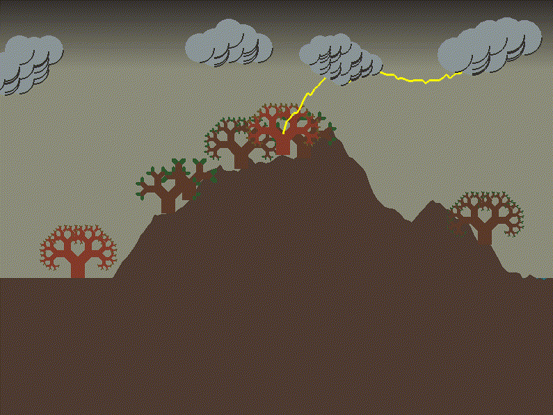
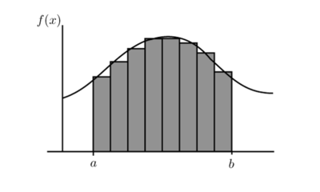

# [EN] Simulation using fractals

This is a simulation-game made with Python 2.7 in “Modelation and Graphic Computation” course.
Follows the methodology of Model View Controller.

Some time a newer version for Python 3.x will be available.

## Before using the application

Before you can use the application, you must have installed the requirement packages listed on ‘Requirements.txt’.
You can install them with pip, by the command `pip install -r requirements.txt`.

## Running the application

To run the application, you need to execute the ‘main.py’ file.
This can be done by the command `python main.py`.

## Controls

- A: Add a tree
- Space: Throw a lightning
- M: Throw many lightnings
- Q: Quit the game

# [ES] Simulación con fractales

Esta es una simulación juego realizada en Python 2.7 durante el curso «Modelación y computación gráfica».
Sigue la metodología Modelo Vista Controlador.

En algún momento se tendrá una versión más actualizada para Python 3.x.

Se simula una tempestad donde se modela el paisaje (montañas, lagos, nubes y árboles) y los rayos usando fractales.

  

## Antes de utilizar la aplicación

Antes de que usted pueda usar la aplicación, debe contar con los paquetes mencionados en el archivo ‘Requirements.txt’.
Se pueden instalar mediante la herramienta pip, con el comando `pip install -r requirements.txt`.

## Ejecutar la aplicación

Para ejectar la aplicación, se debe ejectar el archivo ‘main.py’.
Esto se puede hacer mediante el comando `python main.py`.

## Controles

- A: Agregar un árbol
- Espacio: Lanzar un rayo
- M: Lanzar muchos rayos
- Q: Salir del programa

## Modelos

Cada modelo fue implementado en una clase de su mismo nombre, con un constructor y por lo menos el método `dibujar`, encargado de dibujar el objeto por cada ciclo.
En el controlador, los modelos se dibujaban en un orden específico para garantizar la correcta superposición en la escena: primero el fondo, después la cordillera, luego los árboles y finalmente las nubes. Cuando se generaban rayos, estos se dibujaban después de los árboles y antes de las nubes, para simular «ser lanzados» desde ellas.

  

### Cordillera

A partir del ancho y alto de la ventana de la escena, y la altura del suelo, el factor de rugosidad, el espaciado de la malla a dibujar y el ancho de la cordillera, se genera el arrelo `puntosBorde`, que delimita los puntos de borde del suelo, con puntos equiespaciados. Cada índice $i$ del arreglo corresponde a la coordenada $x$ del punto, mientras que el valor $\text{puntosBorde}_i$ corresponde a la altura del suelo en ese punto.

Dados $h$ la altura del suelo, $dh$ el espaciado de la malla en pixeles, $m$ la altura generada para controlar la altura de la cordillera y $a$ las alturas aleatorias calculadas por el paseo aleatorio, cada punto $(x, y)$ se define según:
$$ (x, y)_i := (dh\cdot i, puntosBorde_i) $$

#### Paseo aleatorio

Se trabaja en el arreglo con una especie de quicksort, tomando dos puntos $x_i$ y $x_j$ para calcular la altura $y$ del punto medio entre ellos.
Es decir, se calcula $(x_m, y_m)$, siendo $m=(i+j)/2$, de la siguiente manera:
$$ (x_m, y_m) := (x_m, (y_i + y_j) / + r) $$
donde r es un coeficiente aleatoriamente obtenido para generar el fractal, mediante la fórmula
$$ r = s\cdot \text{random.gauss}(0, 1)\cdot \text{abs}(j - i) $$
donde $s$ es el factor de rugosidad de la superficie. De aquí se desprende que a mayor $s$, más rugosa es la superficie.

#### Dibujar

Para dibujar el suelo, se itera por cada punto en `puntosBorde`, dibujándose polígonos de 4 lados con `GL_POLYGON`, de forma similar a la Integral de Riemann.
De esta manera, se dibuja el contorno y al mismo tiempo se «pinta» por dentro.

  
  

### Árbol

  

#### Dibujar

  

### Rayo

  

### Nube

  
  

### Fondos

  

Es in dueñoel CEO para este proyectp.
